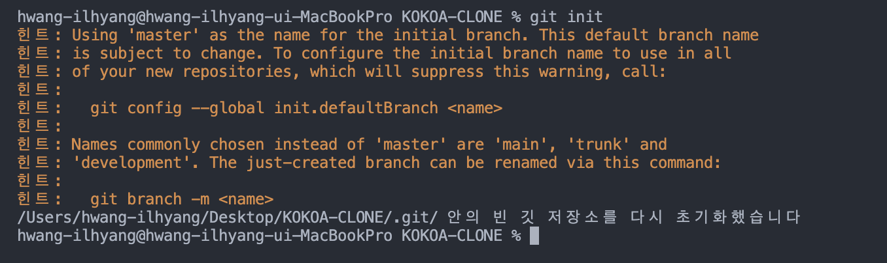

### vscode 처음 켯을때 
1. control + ` (백틱) > 터미널이 열림
2. 원격 레포지토리를 연결하기 위해 터미널에서 git init 명령어를 통해 현재 git 저장소를 초기화 한다.

3. git add . > 내가 초기화한 git 저장소의 전체 파일을 stage 상태로 바꾸겠다
4. git commit -m "메세지" > stage 상태의 파일을 commit(추적이 가능한 상태로 변경)
5. git remote add origin https://github.com/lhh0704/kokoa-clone.git > 내 저장소와 원격 레포지토리 주소 연결
6. git push

selector > title, 등 스타일을 적용할 것
prorperty (속성) > 색상, 글자 크기 등 

selector{
    property: value;
}

css > cascading  위에서 아래로 순차적으로

line: 옆에 다른 요소가 올 수 있음
- 높이와 너비가 없음
- block 처럼 쓰려면, display: block;
- 
block: 옆에 다른 요소가 올 수 없음
- 높이와 너비를 가짐  
- inline 처럼 쓰려면, display: inline;
- margin, border, padding  3가지 요소를 가짐
- margin: box의 border(경계)의 바깥에 있는 공간
- collapsing margins >  흰박스의 경계가 보라색 박스의 경계와 같을 때 일어남, 그때 두 박스의 margin은 하나가 됨, 위 아래 쪽에서만 일어남
- padding: box의 경계로부터 '안쪽'에 있는 공간

*border style mdn 이라고 검색하면 다양한 border 스타일을 볼 수 있음
inline-block은 반응형을 지원하지 않아서 쓰지 않는게 좋음
flexbox
1. 자식에게 명시라지 않고 부모에게만 명시한다. div의 부모를 display:flex로 만든다
2. 주축(main axis, 수평)와 교차축(cross axis, 수직)
   1. justify-content: 디폴트로 주측, 수평 에 해당됨, 
   2. align-items: 디폴트로 교차측, 수직에 해당됨

flex-direction
- flex-direction: column이면 주축은 수직, 교차축은 수평이됨

10/1
position: fiex > div 위치를 고정, 고정된 위치는 초기에 위치한 자리
1. position: fiex
   -  top, left, right, bottom 중 하나만 수정해도 정해진 자리를 바꿀 수 있음, 적용 시 아예 다른 레이어에 존재하기 때문에 div가 같이 있어도 div 위에 얹힐 수 있음

2. position: relative
   - element가 처음 놓인 자리에서 상하좌우로 움직임

3. positon: absolute
   - top, left, bottom, right이 쓰고싶을 때 사용 가능
   - 부모기준이 아닌 body 기준으로 이동
   - 가장 가까운 relative 부모를 기준으로 이동
   - body가 아닌 바로 상위 부모를 기준으로 이동하고 싶다면 absolute 를 적용한 부모를 relative로 만듬

4. Pseudo Selectors
   - 좀 더 세부적으로 엘리먼트 선택
   - 예시
   - span: nth-child(even) >짝수
   - span: nth-child(even) >홀수
   - span: nth-child(2n+1) >원하는 숫자 설정 가능
   - p span{ } > p안에 있는 span에만 적용
   - p > span{ } > 부모와 바로 밑 자식의 관계
   - p + span{} > 형제와 바로 뒤에 오는 형제 관계
   - p ~ span{} > 형제와 형제 관계, 꼭 바로 뒤에 올 필요는 없음

10/2

states
1) active : 대상을 클릭하고 있는 상태
2) hover : 마우스가 대상 위에 있을때의 상태
3) focus : active와 비슷하다고 생각될 수 있는데, 키보드로 선택되었을때를 말한다 !
4) visited : 링크에만 적요이된다 그 링크에 방문했다면 그 안에 스타일이 적용이된다
5) focus-within : focuse된 자식을 가진 부모 엘리먼트의 상태를 말한다
즉, 위의 예시에서 form은 그 자식들인 input이 focuse가 되면 form의 모습을 바꾼다는 것이다

state들을 다른 엘리먼트와 연계해서 사용할 수도 있다
1) 부모의 state에 따라 조정
form:hover input {
background-color: slateblue;
}
즉, form이 hover일경우 input의 백그라운드 컬러가 바뀌게된다
부모의 state에 따라 자식의 state를 조정할 수 있다
2) 부모와 자식의 state에 따라 조정
form:hover input:focus {
background-color: teal;
}

root
- 기본적으로 모든 document의 뿌리가 됨
  :root{
      변수명: 컬러코드
  }
  > 변수를 document의 root에 저장
  - 설정된 root를 쓰고 싶다면
  - p{
    backgroung-color:var(변수명)
    }
  - 변수명 지정 시 처음에 --를 쓰고 변수명을 시작해야한다. 변수명 중간에 빈공간 있을 경우 - 를 써서 채우기

#4.0 Transitions 
- 어떤 상태에서 다른 상태로 변화하는 애니매이션
1. transtion은 state가 없는 요소에 붙어야한다
2. transtion에 변화를 준것들은 state에 들어있는것들이 기준이 되어 바뀌는것이다

#4.1 Transitions part Two
https://matthewlein.com/tools/ceaser

ease-in function : 브라우저에게 변화하는 방법을 알려주는 역할
ㄴlinear - 변화 그래프가 직선
ㄴease-in - 시작과 끝이 빠름
ㄴease-out - 시작과 끝이 느림
ㄴease-in-out - 시작이 빠르고 끝이 느림
all : 변화 요소를 한번에 다룬다.
ㄴ따로 다루고 싶으면 각각 써주면 됨

10/4
#6.2
- BEM: 좀 더 쉽게 읽히는 css

#6.3
- https://heroicons.com/

10/5
#6.6
1.리셋 css
- margin:0, padding:0, border:0 
- https://cssdeck.com/blog/scripts/eric-meyer-reset-css/
- reset.css 파일 만들고 css 파일에 import하기

#6.8
- not
- 포함하지 않게 쓰는 것

#6.9
- form은 중요한 2가지 속성(attribute)을 가지고 있다. 하나는 action이고, 다른 하나는 method이다.
- action은 어떤 페이지로 data를 보낼건지 지정할 수 있다.
- action에 적어 놓은 URL에 해당하는 파일이 반드시 존재해야한다.
- method는 2가지 방식 중 하나를 쓸 수 있다. 하나는 POST이고, 다른 하나는 GET이다.
- POST는 백엔드 서버에 정보를 전송하는 방식이라 이번 강의에서는 사용할 수 없다.
- GET 방식은 보안에 취약하다. username이랑 password를 GET 방식으로 보내선 안된다. URL에 포함되어도 상관없는 정보들을 GET 방식으로 보내는 것이다.

#6.10

-구글도 navigation을 찾아서 ul의 li안에 있는 link를 가져오게끔 설정되어 있다
- 단축
  - nav>ul>li*4>a

#6.12
css box padding의 디폴트 원리
200픽셀의 박스에 50픽셀의 패딩을 주면, css는 기존 박스의 가로를 유지하기 위해 50만큼 박스를 늘림.
이를 막기 위해 box-sizing:border-box를 쓰면 box의 크기를 유지한 채 padding을 줄 수 있다.

#6.14
status-bar와 header-screen이 겹치는 현상이 있으신 분들,
position: sticky; 로 해결해보십시오. (status-bar에 설정)
sticky 속성은 상, 하, 좌, 우 주어진 값이 임계치에 도달할 경우 그 자리에 고정되는 속성이라고 합니다.
저는 top, right, left를 0px주고 fixed를 sticky로 수정했더니 해결되었습니다.
문제 해결에 도움 되시길 바랍니다!