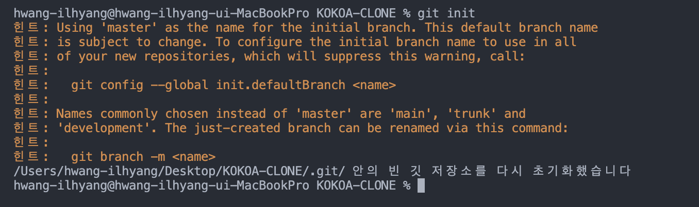

### vscode 처음 켯을때 
1. control + ` (백틱) > 터미널이 열림
2. 원격 레포지토리를 연결하기 위해 터미널에서 git init 명령어를 통해 현재 git 저장소를 초기화 한다.

3. git add . > 내가 초기화한 git 저장소의 전체 파일을 stage 상태로 바꾸겠다
4. git commit -m "메세지" > stage 상태의 파일을 commit(추적이 가능한 상태로 변경)
5. git remote add origin https://github.com/lhh0704/kokoa-clone.git > 내 저장소와 원격 레포지토리 주소 연결
6. git push

selector > title, 등 스타일을 적용할 것
prorperty (속성) > 색상, 글자 크기 등 

selector{
    property: value;
}

css > cascading  위에서 아래로 순차적으로

line: 옆에 다른 요소가 올 수 있음
- 높이와 너비가 없음
- block 처럼 쓰려면, display: block;
- 
block: 옆에 다른 요소가 올 수 없음
- 높이와 너비를 가짐  
- inline 처럼 쓰려면, display: inline;
- margin, border, padding  3가지 요소를 가짐
- margin: box의 border(경계)의 바깥에 있는 공간
- collapsing margins >  흰박스의 경계가 보라색 박스의 경계와 같을 때 일어남, 그때 두 박스의 margin은 하나가 됨, 위 아래 쪽에서만 일어남
- padding: box의 경계로부터 '안쪽'에 있는 공간

*border style mdn 이라고 검색하면 다양한 border 스타일을 볼 수 있음
inline-block은 반응형을 지원하지 않아서 쓰지 않는게 좋음
flexbox
1. 자식에게 명시라지 않고 부모에게만 명시한다. div의 부모를 display:flex로 만든다
2. 주축(main axis, 수평)와 교차축(cross axis, 수직)
   1. justify-content: 디폴트로 주측, 수평 에 해당됨, 
   2. align-items: 디폴트로 교차측, 수직에 해당됨

flex-direction
- flex-direction: column이면 주축은 수직, 교차축은 수평이됨

10/1
position: fiex > div 위치를 고정, 고정된 위치는 초기에 위치한 자리
1. position: fiex
   -  top, left, right, bottom 중 하나만 수정해도 정해진 자리를 바꿀 수 있음, 적용 시 아예 다른 레이어에 존재하기 때문에 div가 같이 있어도 div 위에 얹힐 수 있음

2. position: relative
   - element가 처음 놓인 자리에서 상하좌우로 움직임

3. positon: absolute
   - top, left, bottom, right이 쓰고싶을 때 사용 가능
   - 부모기준이 아닌 body 기준으로 이동
   - 가장 가까운 relative 부모를 기준으로 이동
   - body가 아닌 바로 상위 부모를 기준으로 이동하고 싶다면 absolute 를 적용한 부모를 relative로 만듬

4. Pseudo Selectors
   - 좀 더 세부적으로 엘리먼트 선택
   - 예시
   - span: nth-child(even) >짝수
   - span: nth-child(even) >홀수
   - span: nth-child(2n+1) >원하는 숫자 설정 가능
   - p span{ } > p안에 있는 span에만 적용
   - p > span{ } > 부모와 바로 밑 자식의 관계
   - p + span{} > 형제와 바로 뒤에 오는 형제 관계
   - p ~ span{} > 형제와 형제 관계, 꼭 바로 뒤에 올 필요는 없음
